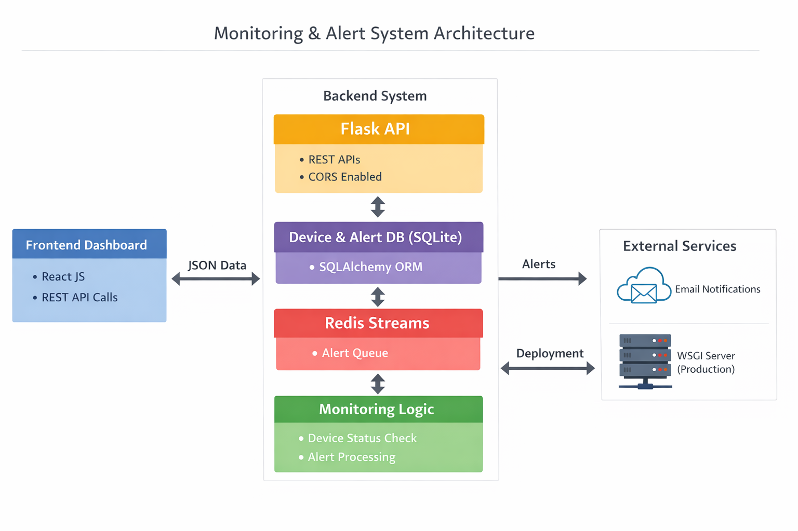

# Unified IT Infrastructure Monitoring & Ticketing System

A full-stack monitoring and alert management system inspired by enterprise IT Infrastructure Management tools.

---

## 🚀 Features
- Device monitoring with simulated health checks
- Asynchronous alert processing using Redis Streams
- Auto ticket creation (ITSM-style incident management)
- REST APIs built with Flask
- React dashboard for live monitoring
- SQLite persistence via SQLAlchemy ORM

---

## 🏗️ Architecture



**Tech Stack Overview:**
- Frontend: React
- Backend: Flask (REST API)
- Database: SQLite
- Messaging: Redis Streams
- Background Workers: Python threads

---

## 📂 Project Structure
```
backend/ → Flask backend
frontend/ → React dashboard
```

---

## ▶️ How to Run

### Backend
```bash
cd backend
pip install -r requirements.txt
redis-server
python app.py
Frontend
cd frontend
npm install
npm start
🧠 Key Concepts Demonstrated
REST API design

Asynchronous processing

Message queues

ITSM ticket lifecycle

Full-stack integration